# System Diagrams - Mermaid Format

## 4.1 Use Case Diagrams

### 4.1.1 User Authentication Module
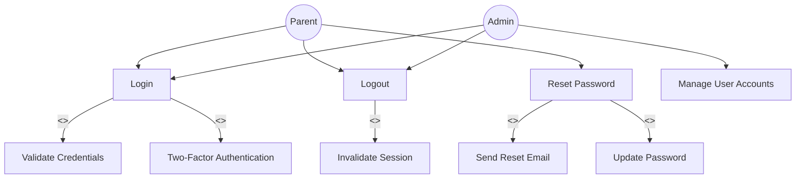

### 4.1.2 User Account Management Module
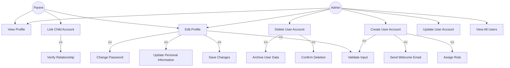

### 4.1.3 Academic Progress Tracker Module
```mermaid
graph TD
    Parent((Parent))
    Admin((Admin))

    Parent --> ViewProgress[View Child Progress]
    Parent --> ViewReports[View Progress Reports]
    Parent --> ExportData[Export Progress Data]

    Admin --> RecordProgress[Record Student Progress]
    Admin --> ViewProgress
    Admin --> GenerateReports[Generate Progress Reports]
    Admin --> ViewAnalytics[View Analytics]

    RecordProgress -->|<<include>>| ValidateData[Validate Data]
    RecordProgress -->|<<include>>| SaveToDatabase[Save to Database]
    RecordProgress -->|<<extend>>| EnterGrades[Enter Grades]
    RecordProgress -->|<<extend>>| AddComments[Add Comments]
    RecordProgress -->|<<extend>>| TrackMilestones[Track Milestones]
    RecordProgress -->|<<extend>>| NotifyParent[Notify Parent]

    ViewProgress -->|<<include>>| FetchData[Fetch Progress Data]
    ViewProgress -->|<<extend>>| FilterBySubject[Filter by Subject]
    ViewProgress -->|<<extend>>| CompareWithPeers[Compare with Peers]

    GenerateReports -->|<<include>>| AnalyzeData[Analyze Data]
    GenerateReports -->|<<include>>| CreateDocument[Create Document]
    GenerateReports -->|<<extend>>| SendEmail[Send via Email]

    ExportData -->|<<include>>| SelectFormat[Select Export Format]
```

### 4.1.4 Preschool Performance Tracker Module
```mermaid
graph TD
    Parent((Parent))
    Admin((Admin))

    Parent --> ViewPerformance[View Performance Metrics]
    Parent --> ViewBehavior[View Behavior Records]
    Parent --> ViewAttendance[View Attendance]

    Admin --> RecordPerformance[Record Performance]
    Admin --> RecordBehavior[Record Behavior]
    Admin --> RecordAttendance[Record Attendance]
    Admin --> ViewPerformance
    Admin --> GenerateReport[Generate Performance Report]

    RecordPerformance -->|<<include>>| SaveAssessment[Save Assessment]
    RecordPerformance -->|<<extend>>| AssessSocial[Assess Social Skills]
    RecordPerformance -->|<<extend>>| AssessMotor[Assess Motor Skills]
    RecordPerformance -->|<<extend>>| AssessCognitive[Assess Cognitive Skills]
    RecordPerformance -->|<<extend>>| FlagConcerns[Flag Concerns]

    AssessSocial -->|<<include>>| CompareMilestones[Compare to Milestones]
    AssessMotor -->|<<include>>| CompareMilestones
    AssessCognitive -->|<<include>>| CompareMilestones

    RecordBehavior -->|<<include>>| TimestampEvent[Timestamp Event]
    RecordBehavior -->|<<extend>>| NotifyParent[Notify Parent]
    RecordBehavior -->|<<extend>>| NotifyAdmin[Notify Admin]

    RecordAttendance -->|<<include>>| UpdateRecord[Update Attendance Record]

    GenerateReport -->|<<include>>| AggregateData[Aggregate Performance Data]
    GenerateReport -->|<<extend>>| IncludeRecommendations[Include Recommendations]

    ViewPerformance -->|<<include>>| LoadData[Load Performance Data]
```

### 4.1.5 Learning Style Analyzer Module
```mermaid
graph TD
    Parent((Parent))
    Admin((Admin))
    System((System))

    Parent --> ViewLearningStyle[View Learning Style]
    Parent --> RequestAssessment[Request Assessment]

    Admin --> ConductAssessment[Conduct Learning Assessment]
    Admin --> ViewLearningStyle
    Admin --> UpdateAssessment[Update Assessment]

    ConductAssessment -->|<<include>>| ValidateCompleteness[Validate Completeness]
    ConductAssessment -->|<<include>>| SubmitToSystem[Submit to System]
    ConductAssessment -->|<<extend>>| InputObservations[Input Observations]
    ConductAssessment -->|<<extend>>| CompleteQuestionnaire[Complete Questionnaire]
    ConductAssessment -->|<<extend>>| RecordActivities[Record Preferred Activities]

    System --> AnalyzeData[Analyze Learning Data]
    System --> GenerateProfile[Generate Learning Profile]

    AnalyzeData -->|<<include>>| CalculateScores[Calculate Style Scores]
    AnalyzeData -->|<<extend>>| IdentifyVisual[Identify Visual Learner]
    AnalyzeData -->|<<extend>>| IdentifyAuditory[Identify Auditory Learner]
    AnalyzeData -->|<<extend>>| IdentifyKinesthetic[Identify Kinesthetic Learner]
    AnalyzeData -->|<<extend>>| IdentifyMultimodal[Identify Multimodal Learner]

    GenerateProfile -->|<<include>>| CreateRecommendations[Create Teaching Recommendations]
    GenerateProfile -->|<<extend>>| ShareWithParent[Share with Parent]
    GenerateProfile -->|<<extend>>| TriggerTutoring[Trigger Tutoring Recommendations]

    ViewLearningStyle -->|<<include>>| LoadProfile[Load Learning Profile]
```

### 4.1.6 Tutoring Recommendations Module
```mermaid
graph TD
    Parent((Parent))
    Admin((Admin))
    System((System))

    Parent --> ViewRecommendations[View Tutoring Recommendations]
    Parent --> RequestTutoring[Request Tutoring]
    Parent --> ProvideFeedback[Provide Feedback]

    Admin --> ViewRecommendations
    Admin --> ImplementRecommendations[Implement Recommendations]
    Admin --> UpdateProgress[Update Implementation Progress]

    System --> GenerateRecommendations[Generate Recommendations]
    System --> AnalyzePerformance[Analyze Performance Data]
    System --> MatchLearningStyle[Match Learning Style]

    GenerateRecommendations -->|<<include>>| CollectStudentData[Collect Student Data]
    GenerateRecommendations -->|<<include>>| CreateTutoringPlan[Create Tutoring Plan]
    GenerateRecommendations -->|<<extend>>| SuggestActivities[Suggest Activities]
    GenerateRecommendations -->|<<extend>>| SuggestResources[Suggest Resources]
    GenerateRecommendations -->|<<extend>>| SuggestStrategies[Suggest Strategies]
    GenerateRecommendations -->|<<extend>>| PrioritizeByImpact[Prioritize by Impact]

    AnalyzePerformance -->|<<include>>| IdentifyWeakAreas[Identify Weak Areas]
    AnalyzePerformance -->|<<include>>| IdentifyStrengths[Identify Strengths]

    MatchLearningStyle -->|<<include>>| RetrieveLearningProfile[Retrieve Learning Profile]

    ImplementRecommendations -->|<<include>>| MarkAsImplemented[Mark as Implemented]
    ImplementRecommendations -->|<<extend>>| RecordFeedback[Record Feedback]

    UpdateProgress -->|<<include>>| SaveProgress[Save Progress]
    UpdateProgress -->|<<extend>>| NotifyParent[Notify Parent]

    ProvideFeedback -->|<<include>>| SubmitFeedback[Submit Feedback]
    ProvideFeedback -->|<<extend>>| AdjustPlan[Adjust Plan]

    ViewRecommendations -->|<<include>>| LoadRecommendations[Load Recommendations]
```

---

## 4.2 Activity Diagrams

### 4.2.1 User Authentication Module

### 4.2.2 User Account Management Module
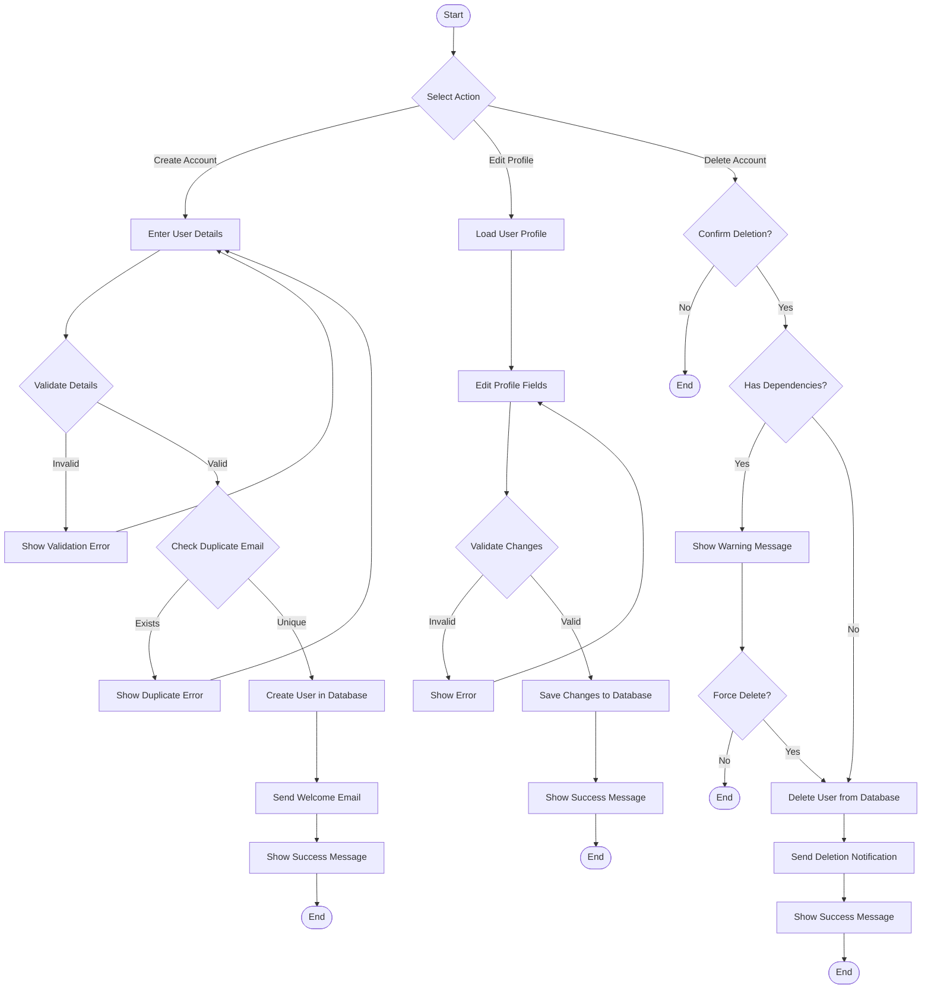

### 4.2.3 Academic Progress Tracker Module
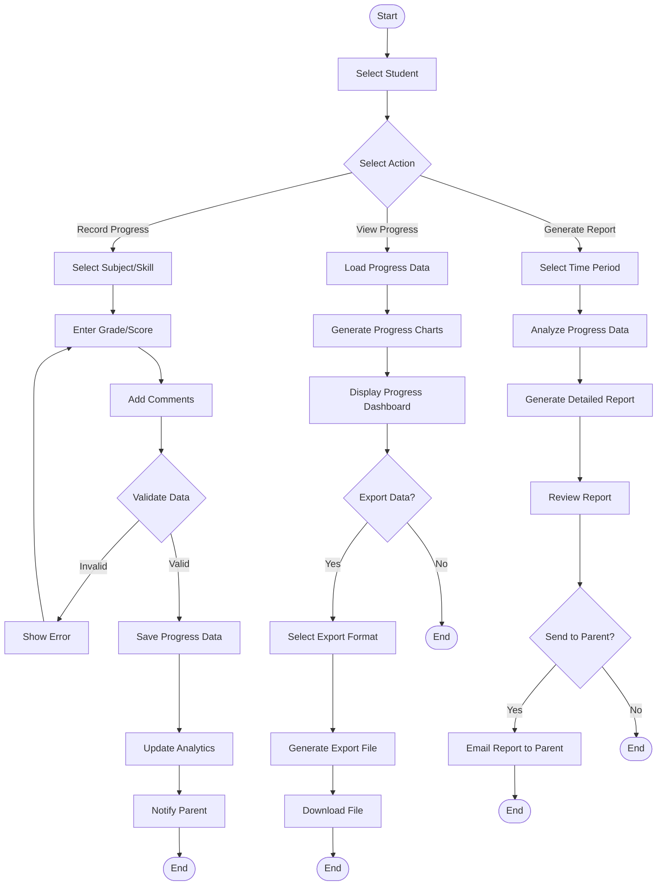

### 4.2.4 Preschool Performance Tracker Module
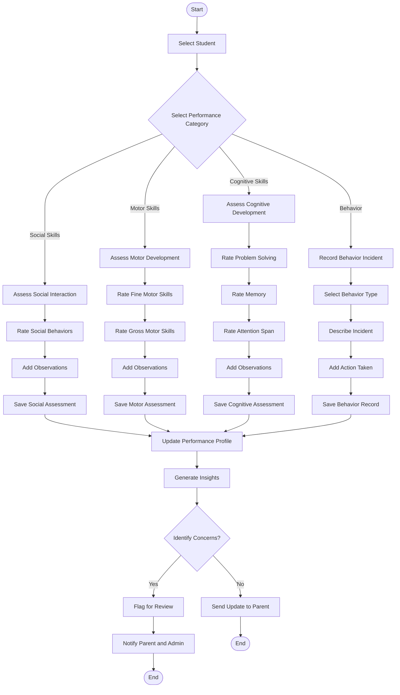

### 4.2.5 Learning Style Analyzer Module
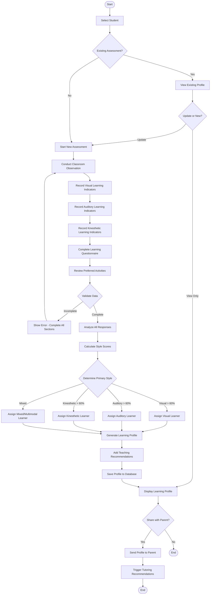

### 4.2.6 Tutoring Recommendations Module
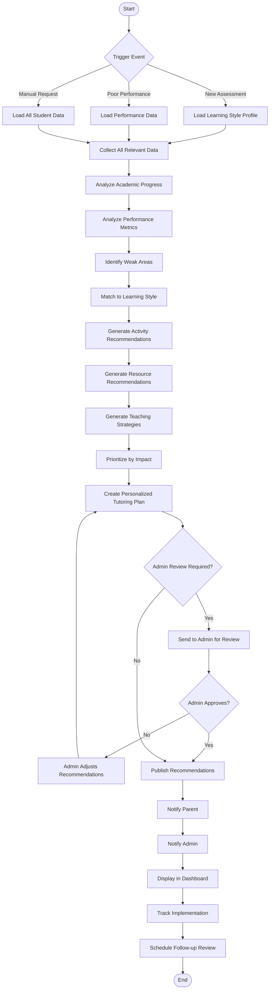

---

## 4.3 Sequence Diagrams

### 4.3.1 User Authentication Module
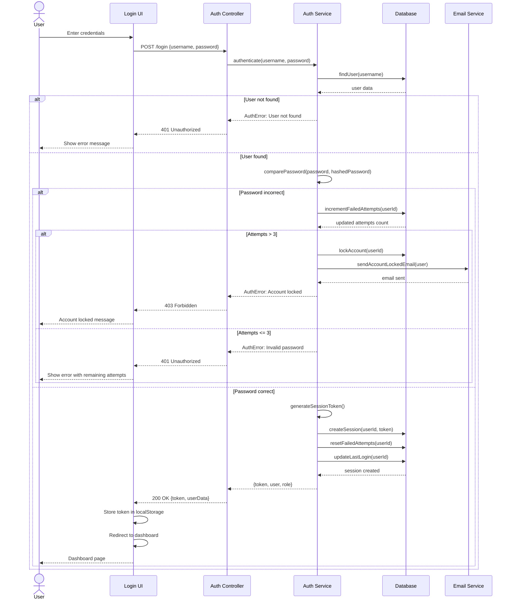

### 4.3.2 User Account Management Module
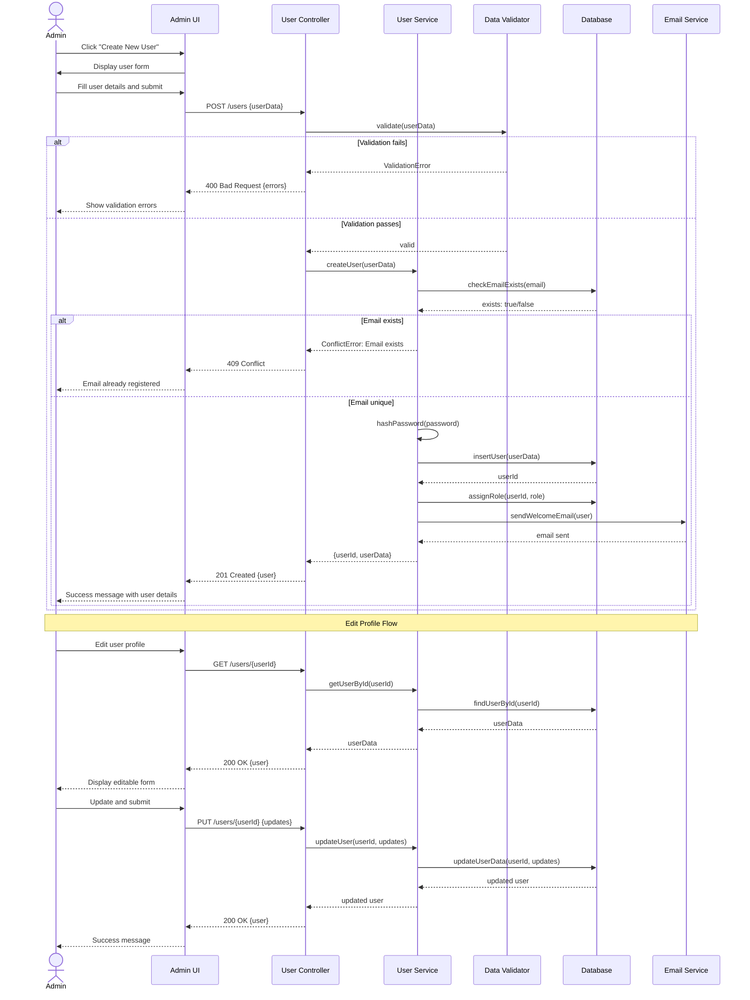

### 4.3.3 Academic Progress Tracker Module
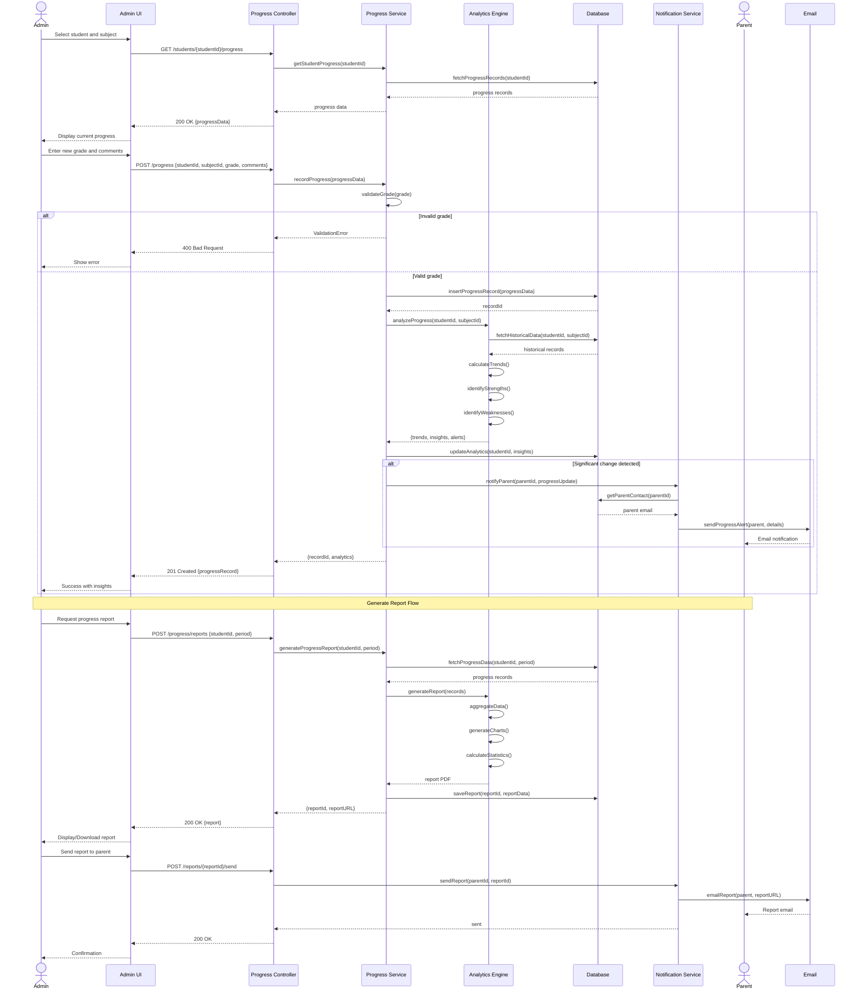

### 4.3.4 Preschool Performance Tracker Module
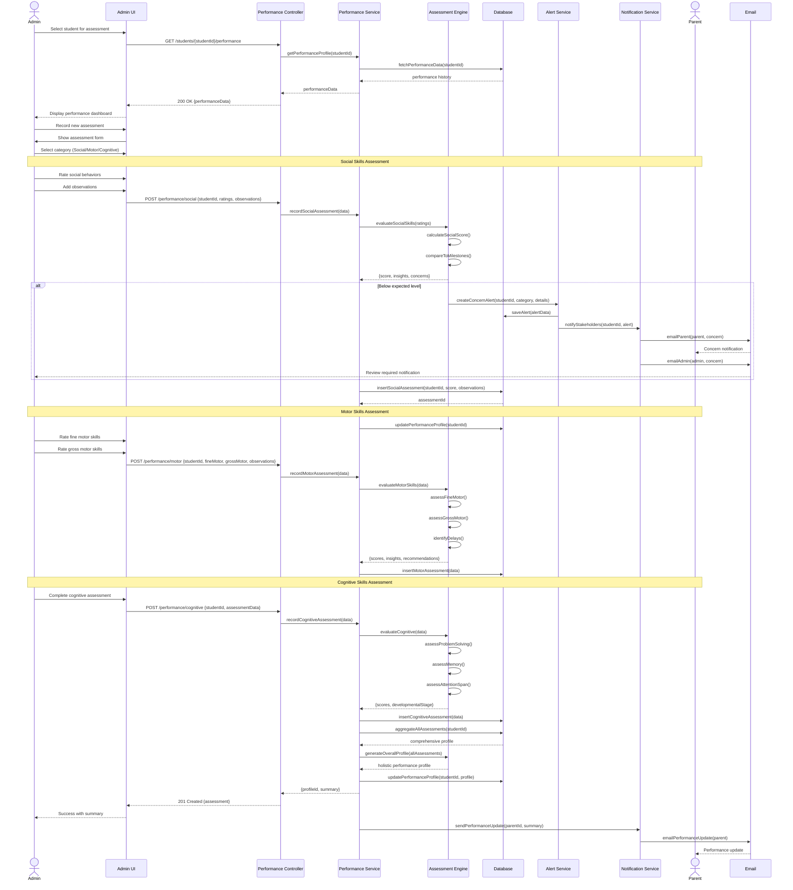

### 4.3.5 Learning Style Analyzer Module
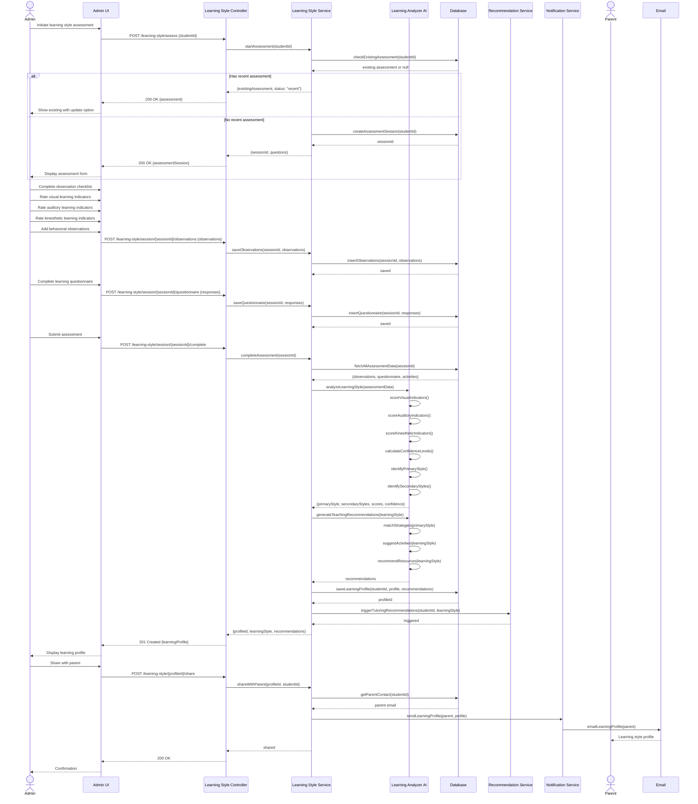

### 4.3.6 Tutoring Recommendations Module

---

## Notes

These diagrams represent:

1. **Use Case Diagrams**: Show the interactions between different actors (Parent, Admin, System) and the system functionalities
2. **Activity Diagrams**: Detail the workflow and decision points for each module's processes
3. **Sequence Diagrams**: Illustrate the interaction between different components (UI, Controllers, Services, Database) over time

### System Roles
- **Parent**: Can view their child's progress, performance, learning styles, and recommendations
- **Admin**: Manages all system operations including recording progress, conducting assessments, and managing user accounts
- **System**: Automated processes for analyzing data and generating recommendations

You can render these Mermaid diagrams using:
- GitHub Markdown (supports Mermaid natively)
- Mermaid Live Editor (https://mermaid.live)
- VS Code with Mermaid extensions
- Documentation platforms like GitBook, Docusaurus, etc.
