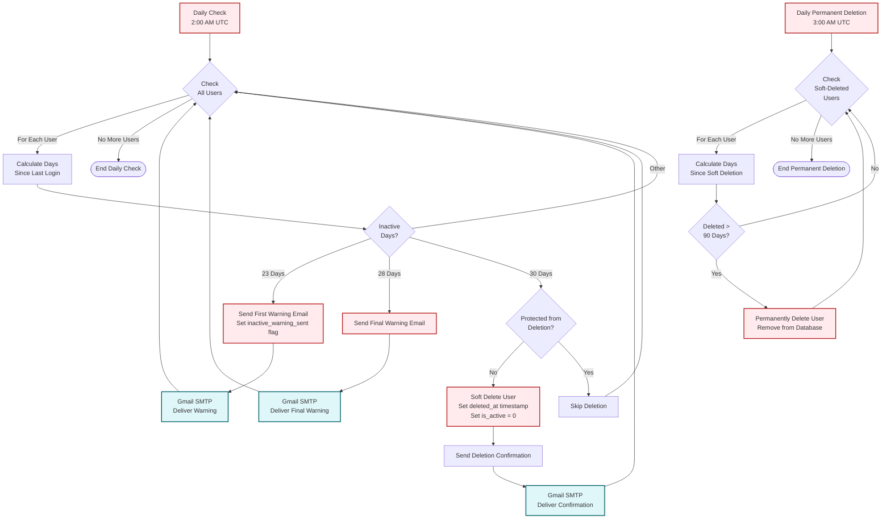

# Preschool Performance Tracker - Overall Activity Diagram

## Overview Flow Diagram (Mermaid)

```mermaid
flowchart TD
    Start([Start]) --> Login[Display Login Page]
    Login --> EnterCred[User Enters Credentials]
    EnterCred --> Auth{Valid<br/>Credentials?}

    Auth -->|No| Error[Display Error Message]
    Error --> ForgotPwd{Forgot<br/>Password?}
    ForgotPwd -->|Yes| ResetEmail[Enter Email for Reset]
    ResetEmail --> SendReset[Generate Reset Token<br/>Send Email via Gmail SMTP]
    SendReset --> ClickLink[User Clicks Reset Link]
    ClickLink --> NewPwd[Enter New Password]
    NewPwd --> HashPwd[Hash & Update Password]
    HashPwd --> End1([End])
    ForgotPwd -->|No| End1

    Auth -->|Yes| CheckRole{User<br/>Role?}

    %% Parent Flow
    CheckRole -->|Parent| ParentDash[Access Parent Dashboard]
    ParentDash --> SelectChild[Select Child Profile]
    SelectChild --> ChooseActivity[Choose Activity]

    ChooseActivity --> ActivitySwitch{Activity<br/>Type?}

    %% Preschool Development
    ActivitySwitch -->|Preschool Dev| EnterObs[Enter Developmental Observations<br/>4 Domains: Social/Emotional,<br/>Cognitive, Language, Movement]
    EnterObs --> StoreObs[Store in Database]
    StoreObs --> LoadBench[Load CDC Benchmarks]
    LoadBench --> CheckCache1{AI Results<br/>Cached?}
    CheckCache1 -->|No| CallAI1[Call Google Gemini AI<br/>Analyze Against Benchmarks]
    CallAI1 --> CacheResult1[Cache AI Results]
    CheckCache1 -->|Yes| GetCache1[Retrieve Cached Results]
    CacheResult1 --> ViewDev[View Development Analysis]
    GetCache1 --> ViewDev
    ViewDev --> MoreAct1{More<br/>Activities?}

    %% Learning Style
    ActivitySwitch -->|Learning Style| LogLearn[Log Learning Observations<br/>Complete Questionnaires<br/>Visual, Auditory, Kinesthetic, R/W]
    LogLearn --> StoreLearn[Store Responses]
    StoreLearn --> CheckCache2{AI Results<br/>Cached?}
    CheckCache2 -->|No| CallAI2[Call Google Gemini AI<br/>Analyze Learning Patterns]
    CallAI2 --> CacheResult2[Cache AI Results]
    CheckCache2 -->|Yes| GetCache2[Retrieve Cached Results]
    CacheResult2 --> ViewLearn[View Learning Style Profile]
    GetCache2 --> ViewLearn
    ViewLearn --> MoreAct1

    %% Academic Progress
    ActivitySwitch -->|Academic Progress| EnterScores[Enter Subject Scores<br/>Math, English, Science, etc.]
    EnterScores --> ValidateScores[Validate Scores 0-100]
    ValidateScores --> StoreScores[Store in Database]
    StoreScores --> GenCharts[Generate Progress Charts]
    GenCharts --> ViewTrends[View Academic Trends]
    ViewTrends --> MoreAct1

    %% Tutoring Recommendations
    ActivitySwitch -->|Tutoring Recs| AggData[Aggregate All Child Data<br/>Preschool + Learning + Academic]
    AggData --> CheckCache3{AI Results<br/>Cached?}
    CheckCache3 -->|No| CallAI3[Call Google Gemini AI<br/>Generate Holistic Analysis<br/>Extract Product Recommendations]
    CallAI3 --> GenLinks[Generate E-commerce Links<br/>Amazon, Shopee, Lazada]
    GenLinks --> CacheResult3[Cache AI Results]
    CheckCache3 -->|Yes| GetCache3[Retrieve Cached Results]
    CacheResult3 --> ViewTutor[View Tutoring & Product<br/>Recommendations]
    GetCache3 --> ViewTutor
    ViewTutor --> MoreAct1

    %% AI Insights
    ActivitySwitch -->|AI Insights| AggAcadGame[Aggregate Academic<br/>& Game Data]
    AggAcadGame --> CheckCache4{AI Results<br/>Cached?}
    CheckCache4 -->|No| CallAI4[Call Google Gemini AI<br/>Analyze Performance Trends<br/>Identify Strengths/Weaknesses]
    CallAI4 --> CacheResult4[Cache AI Results]
    CheckCache4 -->|Yes| GetCache4[Retrieve Cached Results]
    CacheResult4 --> ViewInsights[View Comprehensive Insights]
    GetCache4 --> ViewInsights
    ViewInsights --> MoreAct1

    %% Learning Plan
    ActivitySwitch -->|Learning Plan| SynthAll[Synthesize All AI Modules<br/>Learning + Preschool +<br/>Tutoring + Insights]
    SynthAll --> CheckCache5{AI Results<br/>Cached?}
    CheckCache5 -->|No| CallAI5[Call Google Gemini AI<br/>Create Weekly/Monthly Plan<br/>Generate Subject Strategies]
    CallAI5 --> CacheResult5[Cache AI Results]
    CheckCache5 -->|Yes| GetCache5[Retrieve Cached Results]
    CacheResult5 --> ViewPlan[View Personalized Learning Plan]
    GetCache5 --> ViewPlan
    ViewPlan --> MoreAct1

    %% Resources
    ActivitySwitch -->|Resources| LoadRes[Load Resources from Database<br/>Filter by Age & Type]
    LoadRes --> BrowseRes[Browse Resources<br/>Videos, Books, Articles,<br/>Apps, Games]
    BrowseRes --> AccessURL[Access External Resource URLs]
    AccessURL --> MoreAct1

    %% Mini-Games
    ActivitySwitch -->|Mini-Games| SelectGame[Select Game<br/>Counting Animals,<br/>Animal Vocabulary,<br/>Animal Spelling]
    SelectGame --> PlayGame[Play Game]
    PlayGame --> TrackScore[Track Score & Time<br/>Store Results]
    TrackScore --> ViewGamePerf[View Game Performance]
    ViewGamePerf --> MoreAct1

    %% Child Management
    ActivitySwitch -->|Child Mgmt| EditChild[Add/Edit/Delete Child Profile<br/>Name, DOB, Gender, Grade]
    EditChild --> UpdateChild[Update Database<br/>Calculate Age]
    UpdateChild --> MoreAct1

    %% Profile Management
    ActivitySwitch -->|Profile Mgmt| EditProfile[Update Profile<br/>Change Password]
    EditProfile --> UpdateProfile[Update User Profile<br/>Hash New Password]
    UpdateProfile --> MoreAct1

    MoreAct1 -->|Yes| ChooseActivity
    MoreAct1 -->|No| Logout1[Logout]
    Logout1 --> End2([End])

    %% Admin Flow
    CheckRole -->|Admin| AdminDash[Access Admin Dashboard]
    AdminDash --> ChooseAdminTask[Choose Admin Activity]

    ChooseAdminTask --> AdminSwitch{Admin<br/>Task?}

    %% User Management
    AdminSwitch -->|User Mgmt| ViewUsers[View All Users]
    ViewUsers --> SelectAction{User<br/>Action?}
    SelectAction -->|Edit| EditUser[Modify User Details]
    EditUser --> UpdateDB1[Update Database]
    SelectAction -->|Delete| SoftDel[Soft Delete User<br/>Set deleted_at, is_active=0]
    SoftDel --> UpdateDB1
    SelectAction -->|Restore| RestoreUser[Restore Deleted User<br/>Clear deleted_at, is_active=1]
    RestoreUser --> UpdateDB1
    SelectAction -->|Toggle Protection| ToggleProt[Toggle Deletion Protection<br/>Update protected_from_deletion]
    ToggleProt --> UpdateDB1
    UpdateDB1 --> MoreAdmin1{More<br/>Tasks?}

    %% Resource Management
    AdminSwitch -->|Resource Mgmt| EditRes[Create/Edit/Delete Resources<br/>Title, Type, Description<br/>Age Range, URL]
    EditRes --> UpdateDB2[Update Resources Database]
    UpdateDB2 --> MoreAdmin1

    %% Game Management
    AdminSwitch -->|Game Mgmt| EditGames[Edit Game Metadata<br/>Set Difficulty & Age Range<br/>Toggle Active Status]
    EditGames --> UpdateDB3[Update Games Database]
    UpdateDB3 --> MoreAdmin1

    %% Test Management
    AdminSwitch -->|Test Mgmt| CreateTests[Create Learning Style Tests<br/>Add Multimedia Questions<br/>Text, Images, Audio]
    CreateTests --> CatTests[Categorize by Learning Style]
    CatTests --> UpdateDB4[Update Tests & Questions Database]
    UpdateDB4 --> MoreAdmin1

    %% Manual Cleanup
    AdminSwitch -->|Manual Cleanup| TrigClean[Trigger Manual Cleanup]
    TrigClean --> ExecClean[Execute Inactive User Check<br/>Execute Permanent Deletion<br/>Generate Statistics]
    ExecClean --> ViewStats[View Cleanup Results]
    ViewStats --> MoreAdmin1

    MoreAdmin1 -->|Yes| ChooseAdminTask
    MoreAdmin1 -->|No| Logout2[Logout]
    Logout2 --> End3([End])

    %% Styling
    classDef aiNode fill:#e1f5ff,stroke:#01579b,stroke-width:2px
    classDef parentNode fill:#f3e5f5,stroke:#4a148c,stroke-width:2px
    classDef adminNode fill:#fff3e0,stroke:#e65100,stroke-width:2px
    classDef systemNode fill:#e8f5e9,stroke:#1b5e20,stroke-width:2px

    class CallAI1,CallAI2,CallAI3,CallAI4,CallAI5,CacheResult1,CacheResult2,CacheResult3,CacheResult4,CacheResult5 aiNode
    class ParentDash,SelectChild,ChooseActivity,ViewDev,ViewLearn,ViewTrends,ViewTutor,ViewInsights,ViewPlan aiNode
    class AdminDash,ChooseAdminTask,ViewUsers,ViewStats adminNode
    class StoreObs,StoreLearn,StoreScores,UpdateDB1,UpdateDB2,UpdateDB3,UpdateDB4 systemNode
```



## Automated Background Processes

These processes run independently of user interactions:



## Key Actors

| Actor | Description | Session Timeout |
|-------|-------------|-----------------|
| **Parent User** | Primary end-user who manages children's profiles and tracks development | 30 minutes |
| **Admin User** | System administrator with full access to manage users, resources, games, and tests | No timeout |
| **System** | Backend processing including database operations and AI analysis | N/A |
| **Google Gemini AI** | External AI service (gemini-2.5-flash) for intelligent analysis | N/A |
| **Email Service** | Gmail SMTP for sending notifications | N/A |
| **Scheduler** | Automated task executor (Flask-APScheduler) | N/A |

## Data Flow Summary

```
Parent Input → Database Storage → AI Analysis (with Caching) → Insights & Recommendations → Parent Dashboard
                      ↓
              Scheduled Jobs (2:00 AM & 3:00 AM UTC)
                      ↓
          Email Notifications (Gmail SMTP)
```

## Core Tables

1. **users** - Parent and admin accounts with inactivity tracking
2. **children** - Child profiles linked to parents
3. **academic_scores** - Subject scores over time
4. **preschool_assessments** - Developmental observations by domain
5. **learning_observations** - Free-form learning behavior notes
6. **tests** - Learning style questionnaires
7. **test_questions** - Questionnaire items with multimedia
8. **test_answers** - Child responses to questionnaires
9. **ai_results** - Cached AI analysis (5 modules)
10. **product_recommendations** - AI-generated shopping recommendations
11. **games** - Mini-game metadata
12. **game_results** - Game performance tracking
13. **resources** - Educational resource library

## Technology Stack

- **Backend**: Python 3.x with Flask
- **Database**: MySQL
- **AI**: Google Gemini 2.5 Flash
- **Email**: Gmail SMTP
- **Scheduler**: Flask-APScheduler
- **Frontend**: HTML5, CSS3, Bootstrap, Chart.js

## Security Features

✅ Bcrypt password hashing
✅ Session management with HTTPOnly cookies
✅ Role-based access control (Parent vs Admin)
✅ SQL injection prevention (parameterized queries)
✅ Email verification for password reset
✅ Admin passkey requirement
✅ 30-minute parent session timeout

---

*This diagram represents the complete workflow of the Preschool Performance Tracker module, including all parent activities, admin functions, AI integrations, and automated background processes.*
